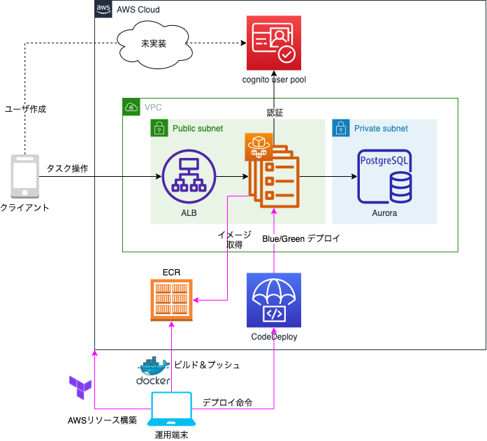

# 概要
ToDoタスクを管理するバックエンドAPIサーバシステムのサンプル。

# API仕様書
FastAPIの自動生成機能により提供されます。
- Swagger: http://{{ドメイン名}}/docs
- ReDoc: http://{{ドメイン名}}/redoc

作成したALBのドメイン名で上記ドメイン名の箇所を置換し、リクエストしてください。

# システム構成図

# 構築手順
[こちら](./docs/construct_procedure.md)を参照

# APIの利用にあたって
[こちら](./docs/api_endpoint_check.md)からAPIの試用利用の方法を記載しています。
